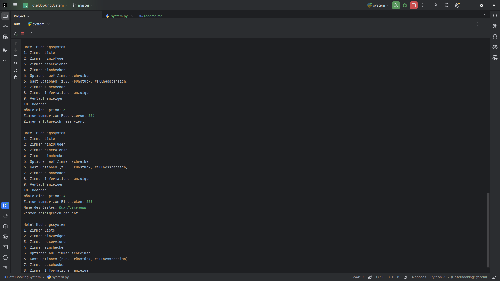
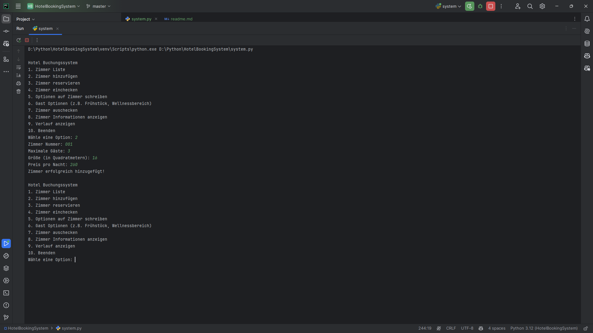
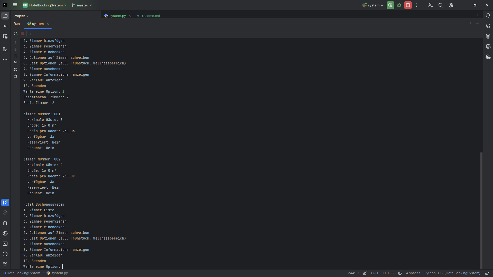
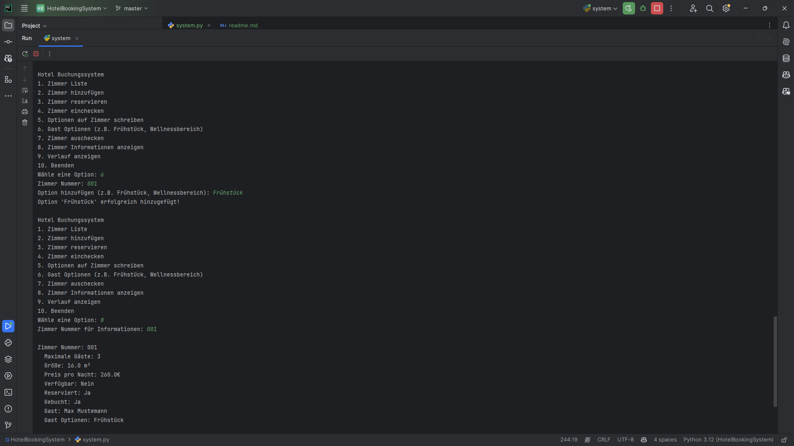
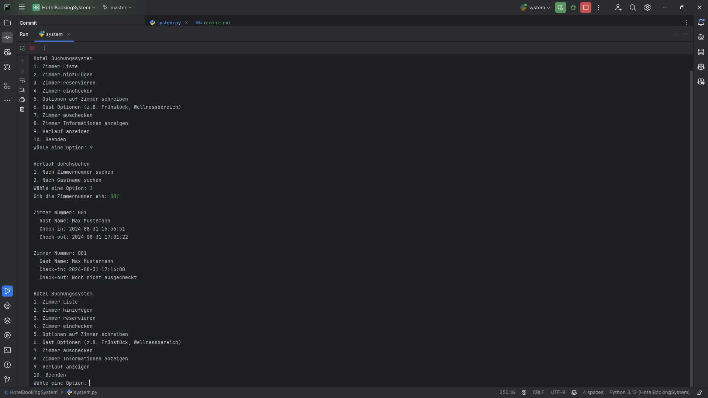
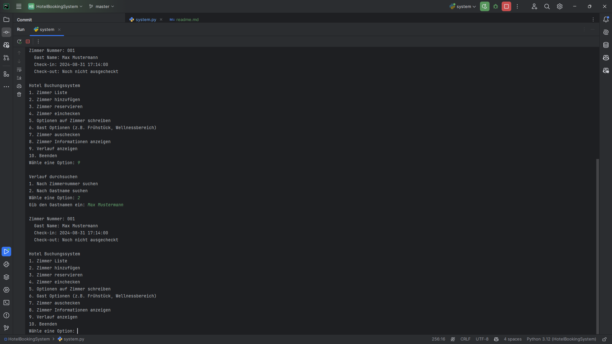
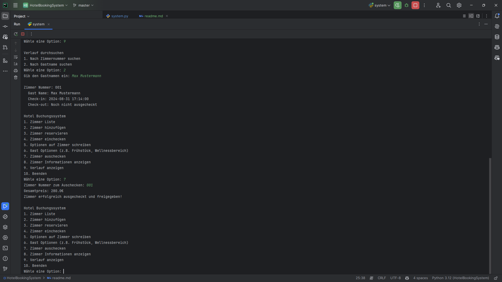

# Little Room Booking System
## Description
This is a simple room booking system to manage the rooms in little hotel.

## Installation
1. Clone the repository
2. Run `pip install -r requirements.txt`
3. Run `python system.py`
4. Follow the instructions of the system

## Features
- Manage Rooms in the Hotel
- Book a Room
- Check Room Availabilitys
- Check Room Status
- Checkout Room
- Room History

## Preview
  
  
  
  
  
  
  
